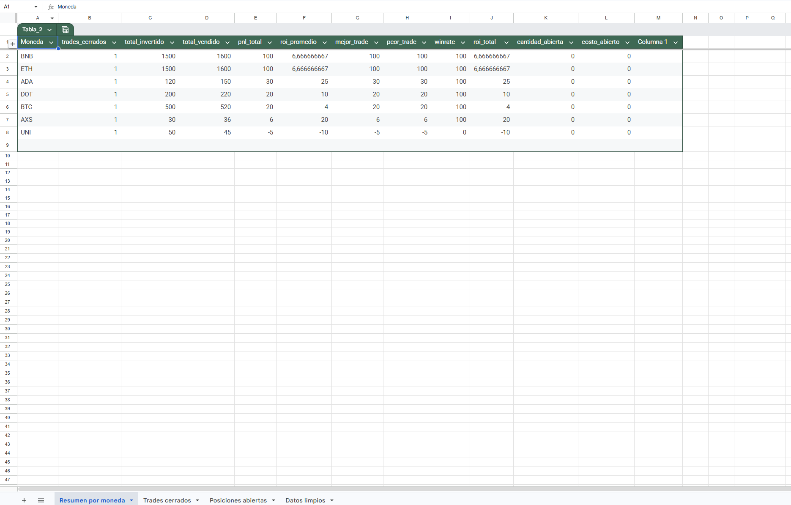

# 📊 Crypto Spot Trading Analyzer

Herramienta desarrollada en **Python** para analizar historiales de operaciones Spot de criptomonedas a partir de archivos **CSV o Excel**.

El objetivo del proyecto es transformar un historial de órdenes Spot en un reporte claro y visual, mostrando ganancias, pérdidas, rendimiento por moneda, posiciones abiertas y gráficos automáticos.

---

## 🚀 Descripción

**Crypto Spot Trading Analyzer** permite importar archivos de operaciones Spot exportados desde exchanges de criptomonedas y procesarlos automáticamente para obtener métricas de rendimiento.

El sistema está pensado para trabajar con archivos en formato:

- `.csv`
- `.xlsx`
- `.xls`

Aunque fue probado con un formato similar al historial Spot de Binance, la estructura del código permite adaptarlo a otros exchanges siempre que el archivo contenga columnas equivalentes como:

- fecha
- par operado
- lado de la operación
- cantidad ejecutada
- precio promedio
- total operado
- estado de la orden

---

## 📌 Funcionalidades principales

- Importación de archivos CSV y Excel.
- Limpieza automática de datos.
- Compatibilidad con nombres de columnas exportados por exchanges.
- Detección de operaciones de compra y venta.
- Cálculo de PnL realizado.
- Detección de posiciones abiertas.
- Cálculo de ROI por operación.
- Resumen por moneda.
- Cálculo de win rate.
- Soporte para método FIFO y LIFO.
- Generación automática de gráficos con Matplotlib.
- Exportación de resultados a Excel.
- Uso de datos ficticios para pruebas.

---

## 📈 Métricas generadas

El reporte permite visualizar:

- Total invertido por moneda.
- Total vendido por moneda.
- Ganancia o pérdida total.
- ROI total.
- ROI promedio.
- Mejor trade.
- Peor trade.
- Cantidad de trades cerrados.
- Win rate.
- Cantidad abierta por moneda.
- Costo abierto de posiciones no cerradas.

---

## 📊 Gráficos generados

El sistema genera gráficos generales y gráficos individuales por moneda.

### Gráficos generales

- PnL total por moneda.
- ROI total por moneda.
- Cantidad de trades cerrados por moneda.
- PnL acumulado general.
- ROI promedio por moneda.

### Gráficos por moneda

- Ganancia/pérdida por trade.
- ROI por trade.
- PnL acumulado por moneda.

Los gráficos se guardan automáticamente en la carpeta de salida.

---

## 🧮 Método de cálculo

El proyecto permite calcular resultados usando:

```text
FIFO: First In, First Out
LIFO: Last In, First Out
```

Por defecto, el sistema usa:

```python
METODO = "FIFO"
```

Esto significa que la primera compra realizada es la primera que se toma como referencia al momento de cerrar una venta.

---

## 📁 Estructura del proyecto

```text
crypto-spot-trading-analyzer/
├── analizador_binance.py
├── README.md
├── requirements.txt
├── .gitignore
├── spot_demo.csv
├── 01_pnl_total_por_moneda.png
├── 02_roi_total_por_moneda.png
└── excel_reporte.png
```

---

## 🔐 Privacidad

Este repositorio **no incluye datos reales de usuarios**.

El archivo de ejemplo contiene datos ficticios utilizados únicamente para demostrar el funcionamiento del sistema.

Se recomienda no subir historiales reales de trading a repositorios públicos.

---

## ⚙️ Instalación

Clonar el repositorio:

```bash
git clone https://github.com/tu-usuario/crypto-spot-trading-analyzer.git
```

Entrar a la carpeta del proyecto:

```bash
cd crypto-spot-trading-analyzer
```

Instalar dependencias:

```bash
pip install -r requirements.txt
```

---

## ▶️ Uso

Ejecutar el script principal:

```bash
python analizador_binance.py
```

Por defecto, el programa puede procesar un archivo de ejemplo:

```python
ARCHIVO = "spot_demo.csv"
```

Para analizar otro archivo, modificar esa línea por el nombre del archivo deseado:

```python
ARCHIVO = "mi_historial_spot.xlsx"
```

o:

```python
ARCHIVO = "mi_historial_spot.csv"
```

---

## 📤 Salida generada

Al ejecutar el programa, se crea automáticamente una carpeta:

```text
reporte_trading/
```

Dentro se generan:

```text
reporte_trading/
├── reporte_trading.xlsx
├── 01_pnl_total_por_moneda.png
├── 02_roi_total_por_moneda.png
├── 03_cantidad_trades_por_moneda.png
├── 04_pnl_acumulado_general.png
├── 05_roi_promedio_por_moneda.png
└── graficos_por_moneda/
    ├── BTC_01_pnl_por_trade.png
    ├── BTC_02_roi_por_trade.png
    ├── BTC_03_pnl_acumulado.png
    └── ...
```

---

## 📄 Archivo Excel generado

El archivo `reporte_trading.xlsx` contiene varias hojas:

- **Resumen por moneda**
- **Trades cerrados**
- **Posiciones abiertas**
- **Datos limpios**

Esto permite revisar los resultados de forma ordenada y reutilizar la información para análisis posteriores.

---

## 🧪 Datos de ejemplo

El proyecto puede utilizar un archivo ficticio de ejemplo llamado:

```text
spot_demo.csv
```

Este archivo contiene:

- trades ganadores
- trades perdedores
- posiciones abiertas
- posiciones parcialmente cerradas

De esta forma se puede probar el funcionamiento del sistema sin usar datos reales.

---

## 🖼️ Imágenes de muestra del análisis de datos Spot

A continuación se muestran algunas capturas generadas por el proyecto utilizando datos ficticios de ejemplo.

El objetivo es visualizar cómo el sistema procesa un historial Spot, calcula métricas de rendimiento y genera gráficos automáticos con Matplotlib.

### 📊 PnL total por moneda

Este gráfico muestra la ganancia o pérdida total realizada por cada activo operado.


---

### 📈 ROI total por moneda

Este gráfico muestra el rendimiento porcentual total por moneda.


---

### 📄 Formato en Excel terminado final

El programa genera automáticamente un archivo Excel con distintas hojas, incluyendo resumen por moneda, trades cerrados, posiciones abiertas y datos limpios.



---

## 🛠️ Tecnologías utilizadas

- Python
- Pandas
- Matplotlib
- OpenPyXL

---

## 📦 Dependencias

El archivo `requirements.txt` debe contener:

```text
pandas
matplotlib
openpyxl
```

---

## 🧠 Posibles mejoras futuras

- Generación automática de reportes PDF.
- Dashboard web con Streamlit.
- Interfaz web con carga de archivos.
- Soporte para más formatos de exchanges.
- Cálculo de drawdown.
- Análisis estadístico avanzado.
- Modelo de clasificación binaria para estimar si un trade fue ganador o perdedor.
- Integración con modelos de machine learning para análisis de comportamiento del trader.

---

## 🎯 Objetivo del proyecto

Este proyecto fue creado como una herramienta de análisis de datos aplicada al trading Spot.

Además de servir como reporte personal o profesional, también puede funcionar como base para futuros desarrollos relacionados con:

- trading journal automático
- análisis de rendimiento
- dashboards financieros
- modelos predictivos
- aplicaciones de data science aplicadas a criptomonedas

---

## 👨‍💻 Autor

Desarrollado por **Lucas Rimbano**.

Este proyecto forma parte de mi portfolio como estudiante y desarrollador, combinando análisis de datos, automatización con Python y visualización de información financiera.

GitHub: `https://github.com/LucasRimbano`

---

## ⚠️ Aviso

Este proyecto tiene fines educativos y analíticos.

No constituye asesoramiento financiero, recomendación de inversión ni garantía de resultados futuros.
